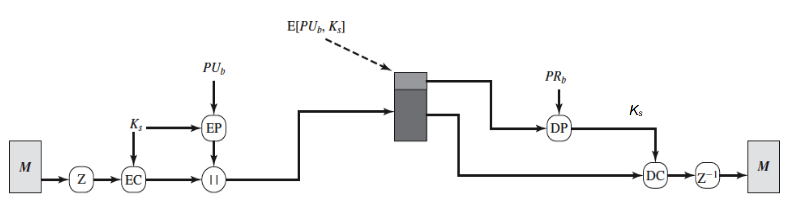
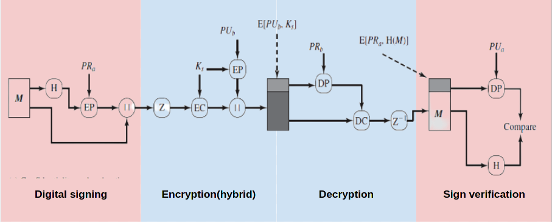
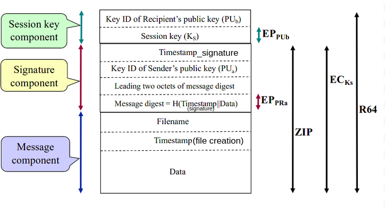
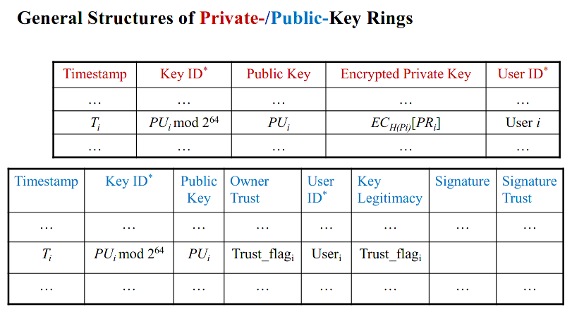
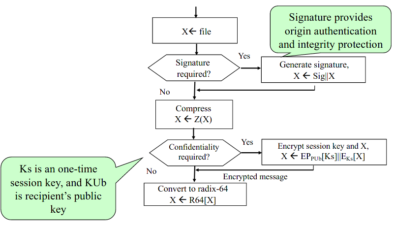
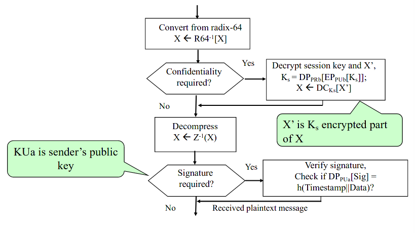

Lecture

# PGP Overview
- PGP is a general purpose application to protect files in storage and emails
- For emails
	- PGP
	- S/MIME
- Same security functionality but
	- PGP is bottom-up (web-of-trust)
	- S/MIME is top-down (PKI X.509)
	- PGP doesn not include sender's public key with each message but it includes a key_ID

# PGP Services
- **Message confidentiality** service: **hybrid encryption**
	- Symmetric key for bulk encryption
	- PKC for encryption of the symmetric key
- **Message integrity**: **digital signature**
- **Origin authentication & non-repudiation of origin**: **web-of-trust**
- **E-mail compatibility**: radix-64 conversion
- **Segmentation**: segment(for sender)/reassemble(for recipient) a long message
- **Compression**: compresses (usally ZIP) a message after applying the signature but before encryption.
	- Hides redundancy in the message making cryptoanalysis harder
	- Reduces the size of the message before encryption. Performance
## E-mail compatibility
- Encrypted messages may contain some arbitrary bytes that are not interpretable by an e-mail reason
- Many email systems allow only ASCII text
- Radix-64 is used to convert each 3 bytes of binary data into four printable ASCII characters

## Confidentiality only
- Message content is encrypted with a symmetric session key
- The session key is encrypted with the recipient’s public key
- **Z/Z-1** - compression/decompression
- **EC/DC** - symmetric-key encryption/decryption
- **EP/DP** - public-key encryption/decryption
- **||** - concatenation

## Confidentiality and Authentication
Order of operations
1. Digital signing
2. Compression
3. Ecnryption

#### PGP Message Format

# PGP Key Rings
- Each user can have multiple PU/PR key pairs so they need IDs
- **Key ID = User ID + least significant 65 bits from Key**

Each user maintains a pair of data structures
- **Private-key ring** - private/public key pairs owned by me
- **Public-key ring** - public keys of other known users
Private keys on a **private-key ring** are ***NEVER*** stored in plaintext. In PGP they are encrypted with symmetric key cipher (CAST-128) and the key is the hash value of a passphrase, *Pi*, chosen by the user.
**Encrypted_PR = ECH(Pi)[PRi]**

# PGP Web-of-Trust
Trust is captured by 3 attributes
- **Owner Trust** - how much I trust this user to sign other users' certificates. (Assigned by the owner of the keyring)
- **Signature Trust** - It reflects the trust the signer (of the certificate) has on the identity of the user identified in the certificate. If Alice signs (i.e. certifies) Bob's key, this is the value she declares she puts trust in Bob’s identity
- **Key Legitimacy** - the degree to which this PGP user trusts that this public key belongs to this owner (Calculated by PGP based on heuristics defined by user)

## PGP - Public Key Revocation
- The owner of the key has to generate and broadcast a revocation certificate containing the public key to be revoked which is signed with the corresponding private key

# PGP message transmission and reception

## Sending

## Receiving
