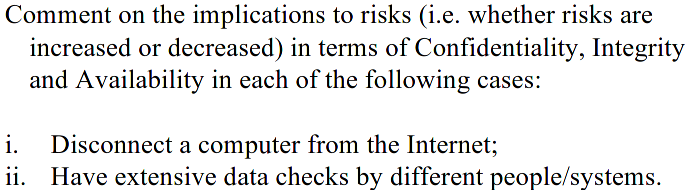

Exercise

# Exercise 1.1

i)
**Risk to Confidentiality** is significantly decreased, since the access is limited to only people with direct access to the system.
**Risk to Integrity** is also decreased since the data is never in transit, thus no communication over an insecure channel where someone might tamper with the data.
**Risk to Availability** is reduced since
ii)
**Risk to Confidentiality** is increased since many people view the data and some of them might leak it.
**Risk to Integrity** is reduced since the integrity is constantly being checked. But if the people/systems that are doing the checks are compromised they could modify the data so we need to ensure that those people/systems have read-only access.
**Risk to Availability** - the more people/systems that access the server, the more likely it is that they will unintentionally cause a denial of service, delay, etc. Hence, an increased risk to availability
