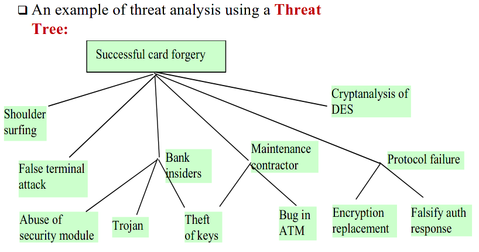
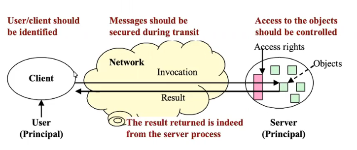
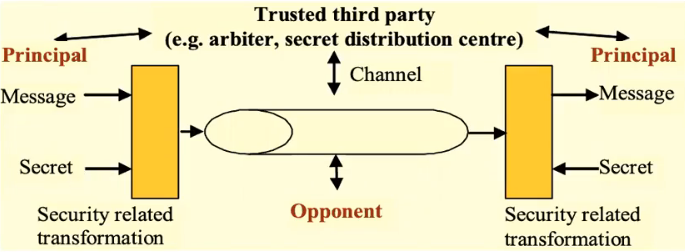
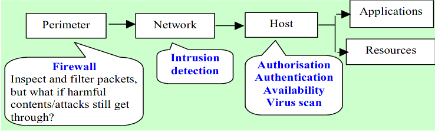

Lecture

 # Threats in a *generic* context
- Disclosure (threats to confidentiality)
- Deception (frauds and forgeries)
- Disruption (availability)
### Types of attacks
- Passive attack (e.g. snooping, sniffing)
- Active attack (e.g. forgeries, denial of service, replay)

## Other stuff
**Repudiation** - false denial of sending receiving
(repudiation of origin / repudiation of receipt)
**Zero-day threats** - i.e. malware attacks. Each malware has a unique signature that can be detected by malware detectors. New malware's signature hasn't been discovered yet so it's hard to detect.
**Polymorphic attack** - This is malware that is designed to have a changing signature, making it signifficantly harder for detection.

# Security properties
### Basic
- **Confidentiality**
	- Keep things hidden
- **Integrity/Authenticity/Authentication**
	- Content integrity (data hasn't been tampered with (not modified) and is fresh (not a replayed))
	- Origin integrity (data is indeed from the claimed source)
- **Availability**
	- Ensure data is available to authorised users
### Advanced
- **Freshness** - Data is not a replay
- **Non-repudiation** - Protect against false denial
- **Fairness** - You get what you paid for

# Achieving Security - Lifecycle
1. Define security goal
	1. Threat analysis - decide what to protect against
	2. Requirement specification - define what is and is not allowed
2. Design and implementation - achieve the security goal - decide HOW to protect in order to satisfy the specification
	- Technical measures (e.g. add encryption)
	- Procedural measures (e.g. limit access for a class of users)
3. Operation and maintenance - testing and monitoring 

### Threat analysis
- Identify assets, threats and vulnerabilities.
	- What is worth protecting. Sometimes the value of an asset doesn't justify the measures taken for protecting it.
	- Likelihood of exploitation
### Security measures
- Prevention
	- Remove vulnerabilities
	- Make attacks harder
	- Make another target more attractive than this target
	- E.g access control, encryption, digital signatures, honey pots
- Detection
	- Measures taken during or after the attacks
	- E.g. logging, auditing, intrusion detection
- Recovery
	- Asses and repair damage
	- Keep systems functioning even if attack succeeds
# Security models
Security model is a scheme for specifying and achieving security policies.

## Distributed system security model

A user accesses remote resources on a server (through an *insecure channel*). Keep data secure both when data is **at rest and in transit**. The two parties don't trust each other and the channel is not secure.

## Communication security model

Focus on keeping data secure **in transit**. The two parties trust each other but the channel is not secure.

## Network security model
Protect data and services on a network against external attacks or unauthorized usage. Multi-level security measures (firewalls, intrusion detection, etc.)

## E-commerce security model
The opponent here is a **misbehaving insider**. Introduces a Trusted third party to resolve disputes. Needs some sort of non-repudiation service for dispute resolution.