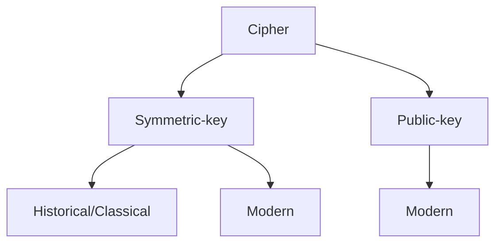
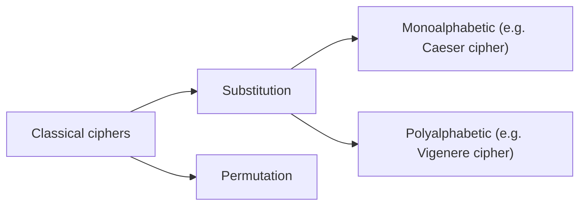

Lecture

# What is Cryptography?
Keeping messages secure by
- Preventing unauthorised access (Access control)
- Scrambling messages so that they cannot be understood by unautorised entities (Cryptography is used here)

Nowadays cryptography is also used outside of message secrecy for achieving:
- Confidentiality of data in transit and at rest
- Data integrity in transit and at rest
- Authentication of an identity (entity authentication)
- Credential systems
- Digital signatures
- Electronic money (e.g. cryptocurrency)

# Achieving Confidentiality using Encryption

# Definitions
**Plaintext** - message in original form
**Ciphertext** - encrypted message
**Cryptosystem** == Cipher
**Cryptoanalysis** - attempts to discover plaintext or key
**Unconditionally secure** - The system cannot be defeated, no matter how much power is available to the adversary
**Conditionally secure** - The power needed to defeat the system surpasses the computational resources of the hypothesized adversary (e.g. unreasonable  amout of computation power or unreasonable time to break)
**Provably secure** - verified to be secure
**Ad hoc security** - Questionable claims of security

# Classical ciphers

### Classical cipher techniques
- Substitution -> Confusion
	- e.g. "abc" becomes "bcd"
	- in modern ciphers : **S-Boxes**
- Permutation -> Diffusion
	- e.g. "abcd" becomes "cdab"
	- in modern ciphers : **P-Boxes**
- XOR operator
- Simple/non-secure ciphers
	- Shift Cipher - Caesar Cipher
	- Vigenere Cipher
- Secure cipher
	- One-time pad
# Common cryptographic attacks
The security of any cipher is based ***not*** on the secrecy of an algorithm, but the security of the cryptographic keys
- Try to break the algorithm by exploring any flaws in the algorithm (*frequency analysis*)
- Assume attackers can recognize a plaintext, try to decrypt a ciphertext with every possible key until a recognised plaintext is found (*brute force*)
	- Given a ciphertext
	- Try all possible keys to find a recognizable plaintext
- Run the algorithm on massive amount of (probable) plaintext until a plaintext that encrypts to the ciphertext he is analysing is found (*dictionary attack*)
	- Given a list of possible plaintexts and a cyphertext to decrypt
	- Find a plaintext P,  s.t. Enc(P) == C
# Types of attacks
- Ciphertext-only attack (e.g. frequency analysis)
	- Attacker knows ciphertexts of several messages encrypted with same key, plaintext is recognizable
	- Goal: to find plaintext, possibly key
- Known-plaintext attack (e.g. dictionary attack)
	- Attacker observes <plaintext, ciphertext> pairs encrypted with same key
	- Goal: to find key
- Chosen-plaintext attack
	- Attacker can choose the plaintext and look at the resulting ciphertext
	- Goal: to find key
- Cryptographic attacks exploit the redundancy of natural language
	- Lossless compression before encryption removes this redundancy