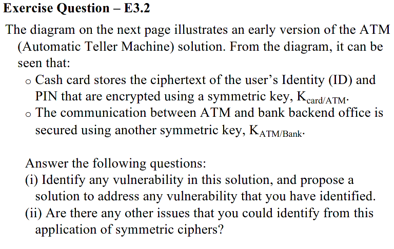
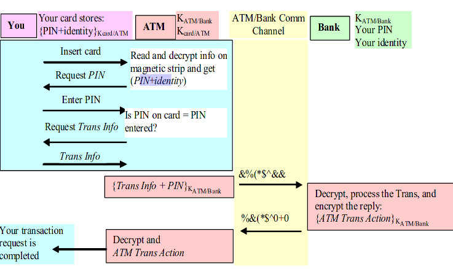

Exercise

# Exercise 3.1
A Meet-in-the-middle attack could be used to break the cipher in 256 trials by observing intermediate values.
# Exercise 3.2

i) If the ATM is hacked it could be used for fraudulent transactions. Since the ATM has access to the PIN+identity on the magnetic strip they could be stored and later used with fake *Trans Info* which will be accepted by the bank and the account will be charged.
To resolve this I would introduce a second symmetrical key cipher with key KC/Bank, known by the customer and the bank. The data on the magnetic strip is E(KC/Bank, {PIN + Indentity}) and is passed by the ATM to the bank along with E(KATM/Bank, {TransInfo + PIN_typed}). The bank then checks if PIN == PIN_typed and sends its decision to the ATM. The ATM doesn't have access to the customer's information at any point
ii) The problem with using symmetrical key cipher is with key management. The bank needs to store the keys for all its customers. In the original solution the problem is even bigger because all the ATMs need to store the Kcard/ATM for all cards in the world. Even worse, the tiny chip on the card needs to store Kcard/ATM for all ATMs to be usable everywhere, which is absurd. And also, each time a card is issued all ATMs need to generate a cipher to be used with that card.