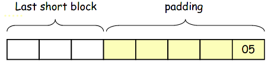

Lecture

# The three operations in encryption
- Key generation function
- Encryption function - C = E(K, M)
- Decryption function - M = D(K, C)
# Block cipher
- Plaintext is divided into blocks and encrypted one at a time
- If last part of message is shorter than the block size - add padding

# Block cipher Requirements
- **Completeness** - **EACH** bit in the *output* should depend on **EVERY** bit of the *input* and **EVERY** bit of the *key*
- **Avalanche effect**(Diffusion) 
	- Changing one bit in the input(or key) changes many bits in the output
	- Achieved by **permutation**
- **Statistical independence**(Confusion)
 	- Input and output should appear to be statistically independent
	- Achieved by **substitution**
# Feistel Block Cipher

1. Initial Permutation(IP)
2. Split result in left and right half
3. r rounds of a (complex) round function (**using different subkey** derived from the key K)

- The bigger the block size, the more secure it is **BUT** slower
- The bigger the key size, the more secure it is **BUT** slower

# DES(Data Encryption Standard)
- A Feistel block cipher
- Block length = **64 bits**
- Key K is **56 bits + 8 bits** of parity-check
- 16 rounds of round operations with keys k1,k2, ... ,k16 each of size **48-bits**
- DES decryption is the same as encryption but with subkeys in reverse order (k16, k15, ... , k1)

## DES - At each round

f is a complex function

## DES - What is f (round function)?
1. Expansion Permutation - permutation + **expansion**(**achieves avalanche effect** because one bit in input can change many bits in output)
	- 32 bits --> 48 bits	
2. XOR result of E/P with the subkey(i.e. round key)
	- 48 bits ***XOR*** 48 bits = 48 bits
3. Splitting - result is split into 8 **lots** of 6 bits each
	- 48 bits --> 8 x 6 bits  
4. S-box (Substitution) - each 6-bit lot is used as an inted to an S-box to produce a 4 bit result
	-  8 x 6 bits --> 8 x 4 bits = 32 bits
	-  each lot uses a different S-box
5. P-box (Permutation) - the 32 bits from the previous operation are permuted according to a single P-box
## DES strength
**Its weakness is the 56-bit key**
- It takes 255 trials to break (brute force)
## Triple DES
- Involves 2 or 3  DES keys
- Made use of the implementations of normal DES, so it was cheaper than going for a completely new standard such as AES
- EDE2 (3DES with 2 keys)
	- C = EK1(DK2(EK1(M)))
	- Key length = 2*56 = **112 bits**
	- Using D instead of E for backward compatibility with single DES. if K1 = K2,  EK1(DK2(EK1(M))) = C = EK1(M)
- EDE3 (3DES with 3 keys)
	- C = EK3(DK2(EK1(M)))
	- Key length = 3*56 = **168 bits**
## Meet in the middle attack
***or why we should never use double encryption (e.g. double DES)***
*(Not to be confused with Man in the middle)*

Double DES - C = EK2(EK1(M))
Brute force trials - 2112

If an attacker has an (M,C) pair:
1.	Attacker encrypts M using all possible values of K1' and stores them in a table
2.	Attacker decrypts C using all possible values of K2' and checks the table
3.	if E(K1', M) == D(K2', C) we've found a candiate pair of keys.

*The trials needed to reveal the real key pair is 256 using MitM instead of 2112*

# AES (Advanced Encryption Standard)
- Faster and stronger than 3DES
- Like DES - a block cipher
- Unlike DES - it is **iterative** rather than **Feistel**
- Unlike DES - the encryption and decryption algorithms are different
- Block size = 128 bits
- Key lengths - 128, 192 or 256 bits (AES-128, AES-192, AES-256)
- S-P cipher involving r rounds
	- AES-128 --> r=10
	- AES-192 --> r=12
	- AES-256 --> r=14
# Modes of encryption
## ECB mode
- Each block is encrypted independentlyusing the same key. The last block should be padded if necessary. 
- Usually the last byte indicates the number of padding bytes added; this allows the receiver to remove the padding.

- Patterns in plaintext show up in ciphertext
- Not recommended to use with anything larger than one block
- Errors in one block do not propagate to other blocks
## CBC mode
- **Ci = EK(Mi XOR Ci-1)**
- Current ciphertext block depends on current plaintext block AND all previous blocks
- Reordering of ciphertext blocks affects decryption
- There is error propagation between blocks
- For the first block we use C0=IV (Initialization vector)
i.e. **C1 = EK(M1 XOR IV)**
## CTR mode (stream cipher)
- Use block cipher encryption as the pseudorandom number generator to generate a key stream for a stream cipher

- The block cipher is used for encrypting the counter value and the actual encryption of the message is performed by the XOR operation
- The counter needs to be synced between sender and receiver so that the ciphertext can be decrypted
- CTR mode is very efficient. Useful for real-time applications
- The counter values can be pre-computed and stored to save time (time-memory tradeoff)
- No error propagation, so useful when transmission errors are probable.

>*Why in CTR mode, only the encryption function of a block cipher is used (decryption is not needed)?*
A: Because CTR mode is used only to generate the pseudorandom number. The actual encryption is achieved by XORing it with the message bytes. XORing the ciphertext with the same pseudorandom number will give us the plaintext.
i.e. **M XOR counter = C** and **C XOR counter = M** 
