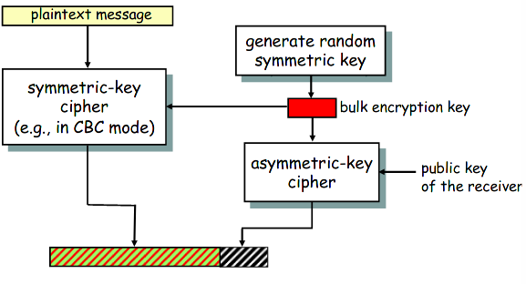

Lecture

# Introduction
## Problems of Symmetric cryptosystems
- Cannot achieve non-repudiation without a trusted third party
- Each pair of users needs a separate key
	- an n-user system requires n*(n-1)/2 keys
	- Key management is hard
	
PKC are based on trapdoor functions
## Commonly used One-way functions
- Integer factorization (used in RSA)
	- n = p*q
	- n is known
	- find p and q
- Discrete logarithm (used in DSA and DH)
	- ax = b mod p
	- a, b and p are known
	- find x
# PKC applications
- some are suitable for **Encryption** (+ **key distribution**)
- some only for **digital signatures**, e.g. DSA
- some for **key agreement**, e.g. DH algorithm
- RSA works for both **encryption** and **digital signatures**

# Mathematical Basics - Modular arithmetic

- Given some integer n, the set of integers [0,1,...,n-1] is the **remainders mod n**

a = b mod n iff a mod n = b mod n

Multiplicative inverse - 
b is multiplicative inverse mod n of a iff a*b mod n = 1

iff **a** and **n** are **relatively prime** i.e. gcd(a,n) = 1 then a has a unique inverse modulo n

a and b are **relatively prime** => gcd(a,b) = 1

## Euler’s Totient/Phi Function (Euler's Theorem)
- if n is prime, all integers [1, n-1] are relatively prime to n, written as φ(n)=(n-1) (i.e. φ(n) gives us the number of integers that are relatively prime to n)
- if we have two different **prime numbers, p and q**, then for **n = p*q**
	- note that φ(p)=(p-1) and φ(q)=(q-1)
	- φ(n)=φ(p*q)=(p-1)*(q-1)
	- For any number a it is true that aφ(n) = 1 mod n
# RSA Algorithm
- There are two numbers
	- the modulus **n**
	- public exponent **e**
- The modulus is the product of 2 very large prime numbers **p** and **q**. **p and q are secret**
- It's a block cipher. Block length is limited by the modulus n. The plaintext and ciphertext, when converted to integers should be between 0 and n-1
## Key generation
1. Select two large primes **p** and **q** (secret)
2. Calculate **n = p*q** and **φ(n)=(p-1)*(q-1)**
3. Select integer e relatively prime to φ(n) 1<e<φ(n)
4. Calculate d = e-1 mod φ(n)
- **public key = {e, n}**
- **private key = {d, n}**
## Encryption
- represent plaintext M as integer; M < n
- C = Memod n
## Decryption
- ciphertext C
- M = Cdmod n

## PKCS Standard
- PKCS#1 standard defines the use of RSA. It defines how the operations should work, how to apply padding, how to use it in digital signatures, etc.

## Security of RSA
- The security of RSA relies on the dificulty of finding d given {e,n} (i.e. the public key).
	- in order to find d, an attacker has to factorise n into p and q in order to compute φ(n) and find out d using d = e-1 mod φ(n)
	- but facorising n into p and q is computationally infeasible, provided that they're big enough integers

# Hybrid Cryptosystems
- PKCs are much slower than symmetric key ciphers.
	- 1000x slower in hardware, and 100x slower in software, compared to DES
- Symmetric key ciphers
	- have a key management problem
	- cannot provide non-repudiation
- If we combine both we can get the best of both worlds
	- use PKC for symmetric key establishment/transportation and/or digital signature generation
	- Symmetric key cipher used for bulk encryption

### Sender
1. Generate symmetric key K
2. Encrypt plaintext using a symmetric key cipher E(K, M)
3. Encrypt symmetric key using the public key of the receiver E(KUR, K) // called digital enveloping
4. Transmit E(K, M)||E(KUR, K)

### Receiver
1. Decrypt E(KUR, K) using PRR
2. Using the now decrypted (plaintext) K decrypt E(K, M) to obtain M