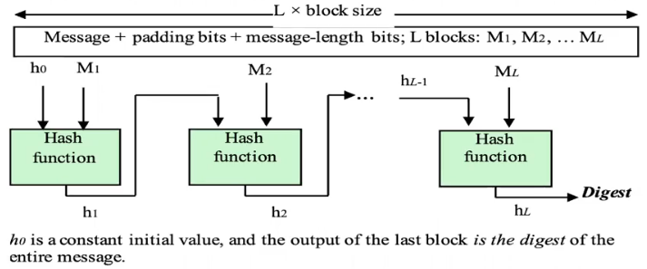
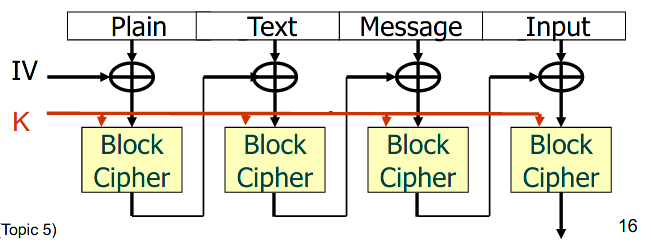
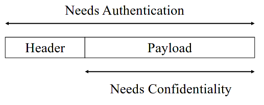

Lecture

# Terminology
Checksum=digest=fingerprint=compressed value=hash value
MAC(Message Authentication Code) = cryptographic checksum

# Need for Cryptographic checksum

- Symmetric encryption A-->B **EK[M]**
	- Provides **confidentiality**
	- Provides **a certain degree** of **origin authentication** as it could only come from A or B
		- BUT the encrypted message could've been altered without A's knowledge
	- Does **not** provide **non-repudiation**
		- A could deny sending the message since B could've also generated EK[M] - repudiation of origin
- Another variant A-->B **EK[M||h(M)]**
	- h is a compressing function
	- Same as above but B could verify if the message was altered (by checking if h(M) matches M), so it provides complete **message authentication** (=origin + integrity)
- Public-key encryption A-->B **EKUb[M||h(M)]** (using B's public key)
	- **Confidentiality**, only B can decrypt it
	- No origin authentication, anyone can encrypt with B's public key
- Digital signing, A-->B **M||EPRa[h(M)]**(using A's private key)
	- **Origin authentication** AND **non-repudiation**
		- A is the only one with PRa, so they cannot deny sending it
		- Anyone can verify with KUa
	- Provides **no confidentiality**

Cryptorgaphic checksum can be used to achieve
- Message authentication (origin + integrity)
- Non-repudiation of origin
	- if PKC is used (use private key to sign)
- Anti-replay (using a nonce)

# Cryptographic Hash functions
- Given a message M of arbitrary length, produces a **fixed-length output**
- H should be a function of ***ALL*** the bits of M
- A Many-to-one mapping so collisions are unavoidable ***BUT*** should make finding collisions as difficult as possible

## Hash Function - Compression Property

## Hash Function - Security Properties
- Preimage resistant (one-way)
	- Given a hash value HM it is infeasible to find the message M that hashed to that value h(M) = HM
- 2nd preimage resistant (weak collision-resistant)
	- Given a message it M and H(M) it is conputationally infeasible to find another M' s.t. H(M') = H(M)
	- Difference from strong collision-resistant: it is for a given M
- Collision resistant (strong collision-resistant)
	- It is conputationally infeasible to find any M and M', M ≠ M' with H(M) = H(M')
	- If it is strong collision-resistant, then it is also weak collision-resistant
# Message Authentication Code (MAC) using Block Ciphers 
- A cryptographic checksum can also be generated using a symmetric block cipher (MAC = fK(M))
- For example, CBC-MAC
	- uses CBC encryption mode
	- the output of the last block is the MAC
- The digest function has an embedded key

- Sender and receiver should have a pre-established symmetric key cipher K
- MAC achieves message authentication (origin + integrity)
- A nonce could be used for added freshness (anti-replay) 
# HMAC
- Uses hash functions like SHA-256, MD5, etc. to be turned into MACing functions
- KeyedHash = Hash(K||Message)
- The key is used as an input to the hash function
- **HMAC(K, M) = H[(K+ XOR opad) || H((K+ XOR ipad) || M]]**
- i.e. HMAC(K, M) = H(K2||H(K1||M))
- where K1 = K+ XOR ipad and K1 = K+ XOR opad
- **K+** = key padded out to the block size of the hash function (e.g. 256 bits for SHA-256)
- **ipad** = repeating 0x36 byte
- **opad** = repeating 0x5c byte
- **Strength of HMAC relies on the hash function, H**
## Properties of CBC-MAC and HMAC
- **HMAC is faster than CBC-MAC**
- **Speed comparison**: Hash < Symmetric key < PKC
- Finding collisions costs 2*n/2* where *n* is the bit-length of the MAC value
- MAC is ***NOT*** a digital signature. No non-repudiation

# Authenticated encryption
- MAC(CBC and HMAC) - message authentication (origin + integrity)
- Authenticated encryption = message authentication + confidentiality
- Possible approaches:
	- **Hash-then-encrypt**: E(K, M||H(M))
	- **MAC-then-encrypt** (used in SSL): E(K2, M||MAC(K1, M))
		- MAC(K1, M) - for origin authentication
	- **Encrypt-then-MAC** (used in IPSec): MAC(K1, E(K2, M))
	- **Encrypt-and-MAC** (used in SSH): E(K2, M)||MAC(K1, M)
## Authenticated encryption approaches - comparison 
- **Encrypt-then-MAC** has higher throughput than **MAC-then-encrypt** this is why it's used in IPSec
	- **MAC-then-encrypt** is more vulnerable to DoS attacks since the recipient needs to perform 2 operations before discarding a message. First decrypt and only then verify the MAC
	- in **Encrypt-then-MAC** the recipient can discard a message without decrypting it. Verify the MAC and only then decrypt it if the MAC is okay.
- **Encrypt-and-MAC** is the quickest as it is parallelisable
## Authenticated encryption with Associated Data (AEAD)
- In some context, such as networks, a message(packet) consists of two parts, a header field and a payload, and they have different security requirements
- In addition, the protections should be provided efficiently

## CCM (used in WiFi)
## GCM
