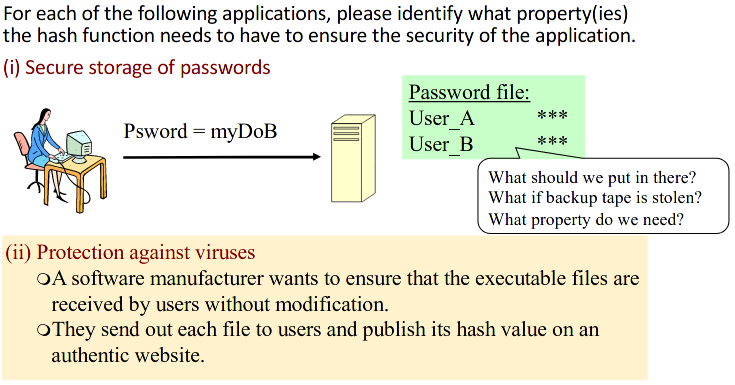
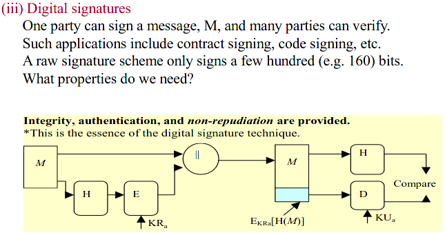

Exercise

# Exercise 5.1

>For a hash value to be used as a cryptographic checksum, it must be protected with a secret, as it is clear, from the above, that a hash function does not have an embedded key.Assuming that a sender, s, is to send a message, M, to a receiver, r. Propose as many different methods as you can to protect the hash value of M to assure the authenticity of M. Comment on the suitability/applicability of each of the methods you propose.

- M||H(M||K) 
- M||E(K, H(M))
- M||E(PRs, H(M))
- E(K, M||H(M))

# Exercise 5.2

i)
**Preimage resistant** - Needed. Shouldn't be able to generate a plaintext password out of a hash.
**Weak collision resistant** - Needed. Given a hash of a password we shouldn't be able to generate a different password that matches this hash. This would mean that a user is accessible through two different passwords.
**Strong collision resistant** - Not needed. It doesn't matter if we could find two values that have the same hash because it is unlikely that they're actual passwords

ii)
**Preimage resistant** - Needed. Shouldn't be able to recover the executable file from a given checksum. A hash is public on the manufacturer's website for verification purposes whereas the executable file could be paid. If we could get the executable file from a checksum we wouldn't have to pay for it.
**Weak collision resistant** - Not needed. Even if someone could forge a file that matches the checksum of the given file it is unlikely that the foreged file will be any useful to anyone. It would probably not be executable anymore.
**Strong collision resistant** - Not needed.

iii) 
**Preimage resistant** - Not needed. It doesn't matter if we can recover the message M from a hash value. For a digital signature confidentiality of the message is not a requirement.
**Weak collision resistant** - Needed. If the receiver can forge another message with the same signature they can claim that the forged message was signed by the sender  as opposed to the actual signed message. 
**Strong collision resistant** - Needed. If the sender can forge a two messages with the same hash we cannot guarantee non-repudiation of origin. The sender can falsely deny sending the message and claim that they've actually send the other message with a matching hash.
# Exercise 5.3
