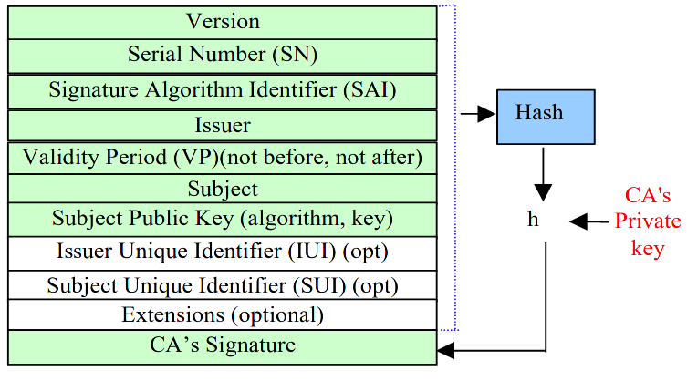
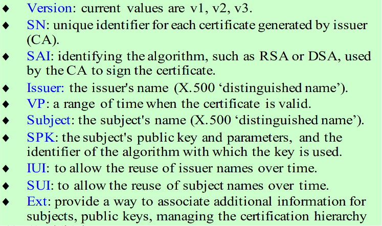
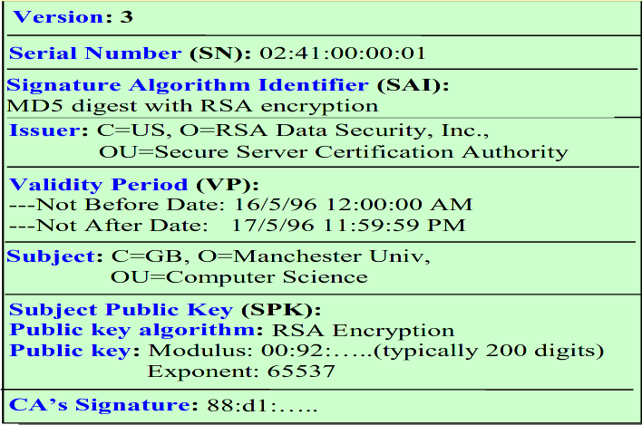
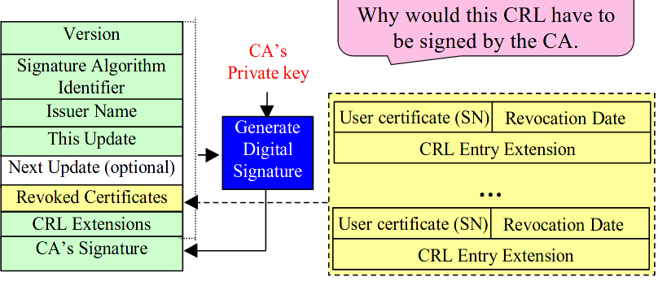

Lecture

# PKI

- If you use a PKC you need a PKI
- PKI provides functions, technologies, policies and services for practical deployment of PKC
- Management and control of public and private keys

**Services offered by PKC**
- Certificate-based user/entity authentication
- Digital signitures
- Encryption, typically for symmetric key distributions, not bulk encryption as it is slow

## Issues when using PKC
- **Issue 1**: How to ensure the security of the private key
	- **Key size** should be large enough
	- **Key expiration** to protect against brute-force attacks
	- **Key management** - secure generation, transportation, storage and revocation (at the end of the lifetime). Keys should be kept secret at all times!
- **Issue 2**: How to encure that the public key is trustworthy? To prevent impersonation
	- Have some trusted entity or authority to sign one's public key -> **digital ceritificate**
	- Otherwise, communications are vulnerable to man-in-the-middle
- A digital/PKI cerificate
	- certifies that the public key indeed belongs to this identity
	- the owner of this identity possesses the coresponding private key
- **PKI Credential** = PKI certificate + matching private key

## PKI entities
- **Registration Authority (RA)** - verifies the identity of the user requesting a certificate
- **Certificate Authority (CA)** - issues and manages PKI credentials
	- Key pair can be issed by the CA or the requester
- **Data Repository** - typically a LDAP directory, is where certificates and revocation status are *officially* stored
	- Data Repository are typically public information because certificates and public keys are public

## PKI - Main Functions
- **SystemSetup** - a CA gets the policy, procedures and services ready, including potential interaction with other providers, e.g. with an RA or other CAs
- **SubjectRegistration** - the subject registers with an RA/CA by providing the following information
- **KeyGeneration** - pair of crypto keys are generated either by the subject or by the CA
- **CertificateIssuance** - the CA issues a certificate for the subject's public key
- **CertificateVerification** - done by the service provider when needed to perform a transaction
- **CertificateRevocation** - Revoke certificate when the private key is compromised or suspected of being compromised
- **Cross-certification** - A pair of CA's sign each other's public keys to establish a trust relationship

# Digital Certificates (X.509 v3)

# Certificate Revocation Lists (CRLs)
- A black list for revoked certificates
- Reasons for revocations
	- Private key is compromised
	- CA may have been compromised
	- Subject's affiliation has changed
	- Key/certificate no longer needed
- Required to reduce
	- risk of impersonation attacks
	- risk of repudiation attacks
		- If someone signs something but regrets signing it. they can say their private key has been compromised and it wasn't them that signed it.
## CRL format (X.509 v2)

Has to be signed by the CA to protect against a repudiation attack. Otherwise, if someone wants to falsely deny signing a message can generate a CRL and put their PKI certificate in the Revoked certificates. 

**CRL Extensions** - same as X.509 v3 Extensions
**CRL Entry Extension** - can specify additional information, e.g. reason for revokation

## Certificate Verification
A certificate is valid *iff*
- it has the **CA signature**
- it is **not expired**
- it is **not revoked** in the latest CRL

# Certificate Hierarchies
Two trust models
- Top-down Certificate Hierarchy (hierarchical trust model); used in X.509 PKI
- Bottom-up Certificate Hierarchy (P2P Trust model/web-of-trust); used in PGP

## Top-down Certificate Hierarchy

- root CA has a self-signed certificate

## Bottom-up Certificate Hierarchy