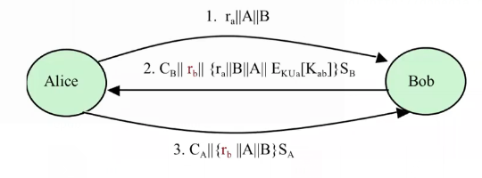

Lecture

# Key Management Issues (for Symmetric-key ciphers)
- Generation issues
- Storage issues
- Distribution issues
- Establishment issues
- Revocation and replacement issues
# Symmetric key (Shared secret) Establishment
## Diffie-Hellman (DH) protocol
### Key Hierarchy
- Master key/secret (key encryption key)
	- used to establish/distribute session keys
- Session key (data encryption key)
	- used to encrypt messages
	- for one logical session only
### Session Keys
- The more often a symmetric key is used, the more likely it is to be compromised
- Generate symmetric key for one session only - **session key**
	- limits availaable ciphertexts for cryptoanalysis
	- limits exposure in an event of key compromise
- To avoid long-term storage of many session keys, they're only generated when needed

### Session Key Establishment
- Key agreement protocols
	- **Diffie-Hellman protocol** - a shared secret (master or session) isderived by the parties **collaboratively**
- Key transportation protocols
	- without using a PKC
		- **Needham-Schroeder protocol** - Session keys are generated and **distributed using symmetric-key cipher** and with the help of a **third party**
	- using a PKC
		- One party creates a session key and securely transfers it to the other party **using the recipient's public key**

### Session Key Establishment - Issues
- ***Key secrecy and entity/key authentication***
	- No other party should be able to gain access to the established session key
	- The session key is established with the intended entities, i.e. **no impersonation**
	- Key confirmation: the other party should be able to demonstrate knowledge of the key by
		- producing a one-way hash value of the key or
		- encrypting some known data (e.g. nonce) with the key
- Key freshness
## DH protocol
- *Alice* and *Bob* agree on two large integers **g** (generator) and **n** (modulus) **// both public**
- Alice has private key PRa and public key PUa
- Bob has private key PRb and public key PUb

1. Alice calculates PUa = gPRa mod n
2. Alice sends PUa to Bob
3. Bob calculates PUb = gPRb mod n
4. Bob sends PUb to Alice
5. Both calculate the **symmetric key Kab**
	- Alice calculates Kab = PUbPRa mod n (== gPRaPRb mod n)
	- Bob calculates Kab = PUaPRb mod n (== gPRaPRb mod n)

**DH protocol is vulnerable to man-in-the-middle attack**

# Symmetric key distribution using symmetric key encryption
## Approach One

- Lots of keys
- For n users n(n-1)/2 keys
- the n2 problem
## Needham-Schroeder Protocol
- It uses a Trusted third party (Key distribution centre (KDC))
- both parties A and B share a secret with KDC, Ka and Kb
- A and B wish to establish a secure communication channel, i.e. establish a one-time session key Kab
- Na, Nb are nonces (random challenges) generated by A and B to keey messages **fresh**

# Symmetric key distribution using PKC (X.509)
## Distribution using PKC - Two passes

- Secret key distribution with mutual authentication
- CA - Certificate of A = PUA + CA signature
- {X}SA = X||E(PRA, H(X))- signed by A
- TS - timestamp
	- ***NOTE***: A's and B's **clocks** have to be **synchronised** and **tamper-proof**
1. Alice sends Bob message 1.
2. Bob uses the public key from CA to verify the signature. (if the certificate is not signed by a trusted CA, or is revoked this step fails)
3. Bob sends back a similar message + a symmetric key KAB that Bob generates, encrypted with A's public key
4. A verifies B's certificate

## Distribution using PKC - Three passes
- When synchronisation of the clocks is not possible use a 3 pass protocol
- uses ra and rb which are nonces instead of timestamps

# Comparison of secret key establishment protocols

- Diffie-Hellman has no Entity Authentication. Impersonation attacks are possible (MitM)
- Needham-Schroeder authenticate by demonstrating knowledge of the symmetric key that was generated by KDC
- X.509 (2 pass)