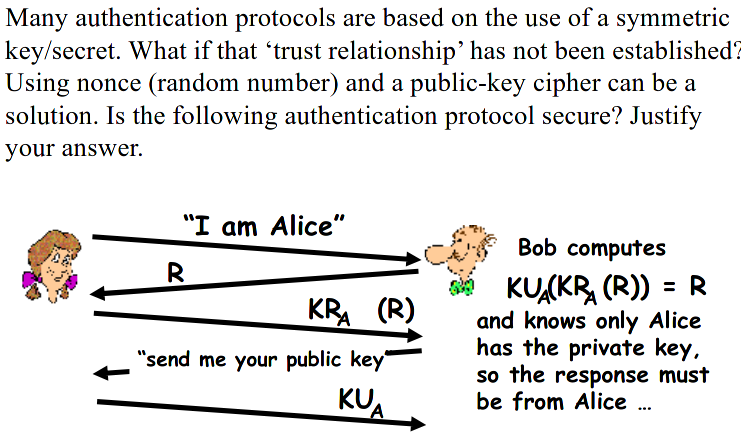

Exercise

# Exercise 9.1

It's not secure.
It's very easy to impersonate Alice. Alice encrypts using her private key and then transfers her public key for Bob to verify. But in no way is Alice's identity verified. She could be someone else posing as Alice.

To make it secure Bob should fetch Alice's credentials from a trusted CA instead of asking Alice for the Public key. That way he knows he can trust the CA and thus the credentials for Alice.

I assume that the protocol is not meant to achieve mutual authentication since none of the steps intend to authenticate Bob in front of Alice.

# Exercise 9.2

> Design two different X.509 certificate based authentication protocols to support mutual authentication between two entities, Alice and Bob. 

Protocol 1:

1. Alice sends Bob E(PUB, R)
2. Bob decrypts using PRB and computes R+1
3. Bob sends Alice E(PUA, R + 1)
4. Alice decrypts and sends Bob H(R + 1). Verifies R + 1 is indeed computed using the R Alice sent in step 1.
5. Bob verifies that H(R + 1) matches the R + 1 he sent.

In all cases PUA or PUB are part of a PKI credential provided by a trusted CA.

Protocol 2:

1. Alice sends Bob E(PRA, R)
2. Bob decrypts using PUA and computes R+1. If he can decrypt using PUA then the encryption in step 1 was indeed by Alice
3. Bob sends Alice E(PRB, R + 1).
4. Alice decrypts and verifies.