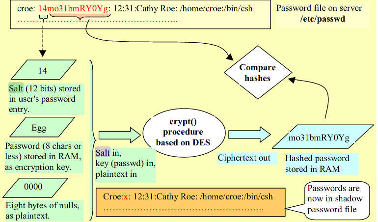

Lecture

**Authentication** - process of verifying a claimed identity
- In the digital world it's usually achieved by demonstrating knowledge of a secret

**AAA service**
- Authentication
- Authorization
- Accounting

# Authentication overview
- Client-server authentication solution
	- Password-based
	- Token-based
		- Symmetric key based
		- PKC based
- Enterprise-wide authentication (single-sign-on SSO)
	- Kerberos (a password centric solution)
	- RADIUS (a centrelised AAA service)
- Shibboleth - authenticate to other enterprises (external authentication)
# Password-based authentication
## Plaintext PW method
- Plaintext PW transfered over the channel
- Channel needs to be secure. Ideally offline
## Hashed PW method
- User information stored in /etc/passwd
	- Read permissions to everyone. Everyone can read usernames, UIDs, full names, etc. 
- Hash of password stored in /etc/shadow
	- Read access ONLY to root. To prevent brute force attacks on the hashes
## Hashed PW with Salt method

# Unix authentication

- Uses **Hashed PW with Salt**
- Hash function is the **Crypt()** algorithm
	- based on the DES algorithm
	- 8 character password form 56-bit key (7 bits ASCII + 1 parity)
	- 12-bit salt to
		- perturb the DES algorithm, to prevent dictionary attacks
		- prevent identical PWs from producting the same hashed PW
- The PW is **used as the key** to the DES algorithm
	- cannot reverse from encrypted password to the plaintext password
	- No need for a separate encryption key. The server doesn't have to store encryption keys for every user.
	- The server doesn't have to store and manage plaintext passwords
## Authentication process
- **Creating account/changing password**
	- the */bin/passwd* program selects a salt based on the time of day; salt is **converted into 2 characters** and stored along with with encrypted password
	- the password is used as the encryption key to encrypt a block of zero bits using *crypt()*
- **Login**
	- the */bin/login* program takes the typed password and the salt from the password file (/etc/passwd in older systems; /etc/shadow in newer) to generate an encrypted password and compares the newly generated password to the one stored in the password file. 
		- Login process: **E(plaintext_pw||salt, 00000000) == stored_encrypted_pw** ?
# Challenge-Response (C/R) authentication protocols
# Enterprise Authentication
- Centrelised authentication
	- One central authority(security server or authentication server)
	- One password for all services 
	- Service servers do not need to handle authentication
	- More secure as authentication servers only interact with service servers
	- Unified enforcement of security policies, e.g. AAA services
## RADIUS
**RAS** - Remote Access Server, i.e. service server
**RADIUS** - Remote Authentication Dial-In User Service, i.e. authentication server
- Client(RAS) forwards the user access request to a RADIUS server
- Server
	- Replies with reject/allow based on the supplied password/credential
	- Challenge(when C-R protocol is used, e.g. CHAP)
	- If C-R is used, client forwards Challenge to user, and the user's Response back to the RADIUS server
	- One RADIUS server can act as a client to another RADIUS server for consultation